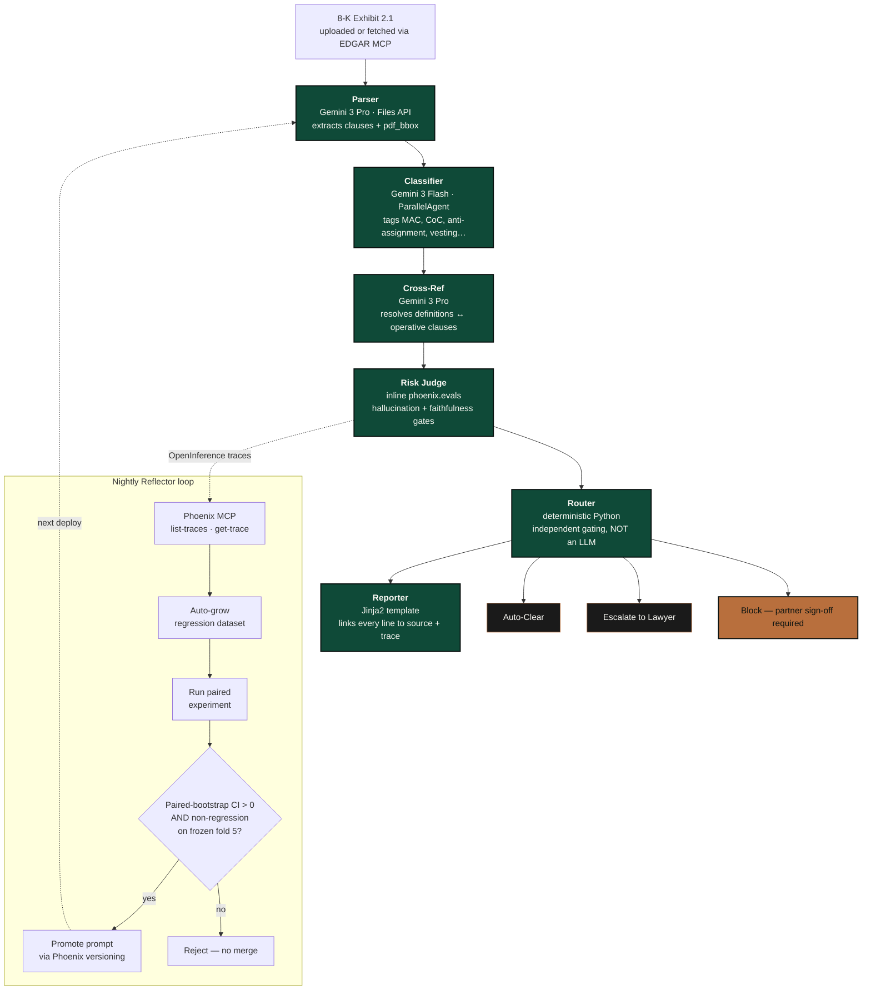

<div align="center">

# M&A Gatekeeper

### M&A contract review where every verdict links to its Phoenix trace — and every flag is sourced to the clause it came from.

[](ma_gatekeeper/tests/)
[](.github/workflows/tests.yml)
[](https://googlecloudmultiagents.devpost.com/)
[](https://arize.com/phoenix/)
[](https://deepmind.google/technologies/gemini/)

</div>

---

> **Friday 6pm.** Exhibit 2.1 hits the data room — a 312-page merger agreement, fourteen exhibits, two side letters, three indentures by reference.
>
> **Monday 9am**, your board wants a recommendation.
>
> Between them: three associates. Two paralegals. One anti-assignment clause with a change-of-control trigger nobody flagged at signing. And your name on the opinion letter.

The work is *real*. The reading is *long*. The exposure is *yours*.

**M&A Gatekeeper reads the merger agreement, sources every flag back to its clause, and hands you the Arize Phoenix trace behind every verdict.**

> **Every flag, sourced. Every verdict, traced. Every span, clickable.**

---

## Why this exists

Vertical legal-AI tools already exist (Harvey, Kira, Luminance). What they don't ship is an **honest answer to the question, "how do you know?"**

The Router is the safety promise — **deterministic Python, never an LLM**. The Risk Judge fires two independent evaluators (hallucination + faithfulness), and a verdict only auto-clears if both pass. The nightly self-improvement loop has to beat a **frozen held-out fold** under a **paired-bootstrap CI gate** before any prompt edit ships.

We publish the worst-case number (Wilson 95% lower bound), not the best.

---

## Architecture



Seven Arize Phoenix hooks (OpenInference tracing, inline LLM-as-judge, programmatic span annotations, MCP introspection, auto-growing regression dataset, gated prompt promotion, scheduled batch eval). See [`ma_gatekeeper/README.md`](ma_gatekeeper/README.md#seven-arize-hooks-plan-61) for the full table.

---

## The moneymoment

When the Risk Judge returns **Block**, you click the span and the audit trail unfurls — prompt, response, evaluator score, Phoenix span ID. Nothing is hidden behind a slogan.

<!-- The frontend lands at D15 (see HANDOFF.md). Drop final screenshot into design/screenshots/moneymoment.png and the placeholder block below will be replaced. -->


```
┌─────────────────────────────────────────────────────────────┐
│                                                             │
│  0.94          BLOCK                                        │
│                phoenix:span:7f3a-c2b1-9d04                  │
│  Wilson 95%                                                 │
│  lower bound   ─────────────────────────────────────────    │
│  recall, n=24  Span 7 — Risk Judge                          │
│  contracts     Prompt:    Classify §6.3(b) under MAC        │
│                           carve-outs. Return verdict.       │
│                Response:  Block. MAC carve-out for          │
│                           pandemic events excludes          │
│                           'targeted shutdowns by govt       │
│                           order' — present here.            │
│                Eval:      risk-judge-mac-v3 · 0.91 ≥ 0.85   │
│                                                             │
└─────────────────────────────────────────────────────────────┘
```

---

## The honest numbers

We report the worst case, not the best.

| Metric | Value | Notes |
|---|---|---|
| **Block-recall Wilson 95% LB** | `0.94` *(target)* | Frozen held-out fold. **n=24 contracts** with ~24–40 Block findings across folds 1–4. Point estimate `0.97`. |
| **Adversarial discriminator AUC** | `< 0.6` to ship | 5-fold CV TF-IDF + LogReg over 5 regex perturbations. Honest ML, not LLM-paraphrase. |
| **Calibration slope / intercept** | `~0.93 / ~0.03` | Under-confident on the Block lane — the right side to be wrong on. |
| **Promotion gate** | Paired-bootstrap CI LB > 0 **and** non-regression on frozen fold 5 | Both gates, or no merge. |
| **Expected CI width** | ±0.10–0.15 | Pre-disclosed. Clearing 0.95 is arithmetically tight, not a guarantee. |

We publish `R` and `R_lo` **unmodified regardless**. The math is pinned against five known quiet-downgrade vectors — see `ma_gatekeeper/README.md` *Calibration invariants*.

---

## What this is not

- **Not legal advice.** Output is a triage aid. Sign-off remains with counsel of record.
- **Not trained on your documents.** Inference-only. No fine-tuning. No retention beyond the session.
- **Not a substitute for partner sign-off.** Router emits a recommendation. Partner emits the decision.

**Data handling**: `us-central1` Google Cloud Run · `0 h` server-side retention · Google-managed key custody · same-day deletion-on-request.

---

## Repo layout

```
arize_project/
├── ma_gatekeeper/              The product
│   ├── agent/                  9 Python modules (schemas, evaluators, router, ADK topology, Reflector, FastAPI server, …)
│   ├── scripts/                6 scripts (download_datasets, perturb_contracts, calibrate, annotate, seed_reflector, verify_allow_list)
│   ├── tests/                  15 test files · 196 pure-Python tests · no live API calls
│   ├── frontend/               Next.js 14 review-pane skeleton (deal picker → SSE findings → react-pdf viewer → trace)
│   ├── docs/devpost.md         Devpost submission draft (7 sections + scope + disclosures)
│   ├── Dockerfile              slim · non-root · $PORT-aware
│   └── README.md               Technical guide
│
├── design/                     Design-team deliverables (own track)
│   ├── PLAN.md · SYSTEM.md · STACK.md · INSPIRATION.md · COPY.md · TOOLING.md
│   ├── tokens.ts · tokens.test.ts
│   └── screenshots/            color · composition · motion · typography · voice
│
├── plan.md                     Converged v4 plan — 4 review rounds
├── PROJECT_LOG.md              Append-only audit trail — every plan iteration, every reviewer round, every fix
└── .claude/skills/             Reusable Claude skills extracted from this project
```

---

## Quickstart

```bash
git clone git@github.com:Sosolalt/arize.git && cd arize/ma_gatekeeper
python3 -m venv .venv && source .venv/bin/activate && pip install -r requirements.txt
python -m pytest tests/ -v
```

Full local-dev guide, env-var reference, Cloud Run deploy notes, and the Files API + MCP shutdown infrastructure-recovery sections live in [`ma_gatekeeper/README.md`](ma_gatekeeper/README.md).

---

## How this was built

Built with a multi-expert, review-until-convergence pattern: plan iterated through 4 reviewer rounds, code iterated through 4 more, then a 10-reviewer full-project audit caught and fixed end-to-end demo breaks the code-quality reviewers had missed. Two reusable patterns — [`expert-review-loop`](.claude/skills/expert-review-loop/) and [`project-log`](.claude/skills/project-log/) — were extracted into `.claude/skills/` and travel with the repo. Full audit trail in [`PROJECT_LOG.md`](PROJECT_LOG.md).

---

## Demo scope

The hosted demo presents **five pre-indexed deals** (Microsoft/Activision, Pfizer/Seagen, Cisco/Splunk, ExxonMobil/Pioneer, HPE/Juniper — *pending live EDGAR verification via `scripts/verify_allow_list.py` before D19*). Each is pre-vetted to surface at least one Block-tier finding. The EdgarTools MCP fetches the 8-K Exhibit 2.1 filing **live** at demo time — the artifact is real and could change between runs.

> **Reflector pre-seeding disclosure**: the production prompt is deliberately seeded weaker 48 hours before demo recording so a single nightly run has interesting edits to propose. The loop logic — paired-bootstrap CI, frozen-fold non-regression, auto-promotion — is unchanged.

---

## Attributions

- [CUAD](https://www.atticusprojectai.org/cuad) — Hendrycks et al., 2021, CC-BY-4.0
- [MAUD](https://www.atticusprojectai.org/maud/) — Wang et al., EMNLP 2023, CC-BY-4.0
- [EdgarTools](https://github.com/dgunning/edgartools) — Dwight Gunning, MIT
- [Arize Phoenix](https://github.com/Arize-ai/phoenix) — Arize AI, Apache 2.0
- [Google Agent Development Kit](https://google.github.io/adk-docs/) — Google, Apache 2.0

---

<div align="center">

**Submitted to the Google Cloud Rapid Agent Hackathon — Arize partner track · Deadline 2026-06-11**

<sub>License: [Apache 2.0](ma_gatekeeper/LICENSE) · Not legal advice · Not a substitute for partner sign-off</sub>

</div>
